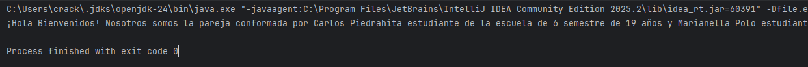
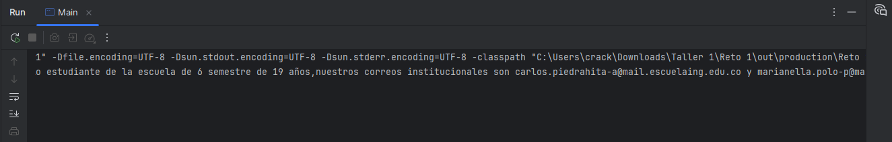

# Reto 1 

Para este primer reto lo que hicimos fue desarrollar la clase de Estudiante la cual tenia los atributos de nombre, edad, correo y semestre; su constructor recibia parametros para todos los atributos y tambien le implementamos los metodos de acceso.
Luego, en la clase principal, creabamos una lista de estudiantes con nuestros datos y para generar el texto de salida lo dividiamos en dos partes, en la primera con un stream y con un Collectors.joining uniamos nuestros datos, en la segunda parte haciamos un proceso similar pero para la parte del correo.







La manera de correr esta prueba es con el siguiente comando (para crear bin, ejecutar y compilar):

```
if (!(Test-Path -Path 'Reto-1\bin')) { New-Item -ItemType Directory -Path 'Reto-1\bin' }
javac -d Reto-1\bin Reto-1\src\*.java
java -cp Reto-1\bin Main
```